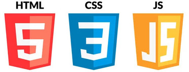
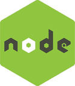
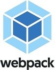

### Я начинающий фронтенд-разработчик.

### Мой стэк:

Пишу SPA-приложения на React, используя функциональные компоненты.
___

- HTML - создаю семантически верную разметку
- СSS - flexbox, grid. В наименовании классов использую методологию БЭМ.
- JavaScript - Изучил базовый JavaScript в синтаксисе ES6, писал в функциональном стиле, со временем освоил ООП.
___

 

Создавал бэкенд-часть веб-приложений, используя NodeJs в связке с фреймворком Express
___
 

 В качестве базы данных для своих проектов использовал MongoDB, разворачивал БД на удалённом linux-сервере.
 ___
 
Перед знакомством с React, практиковался в сборке проектов при помощи Webpack
